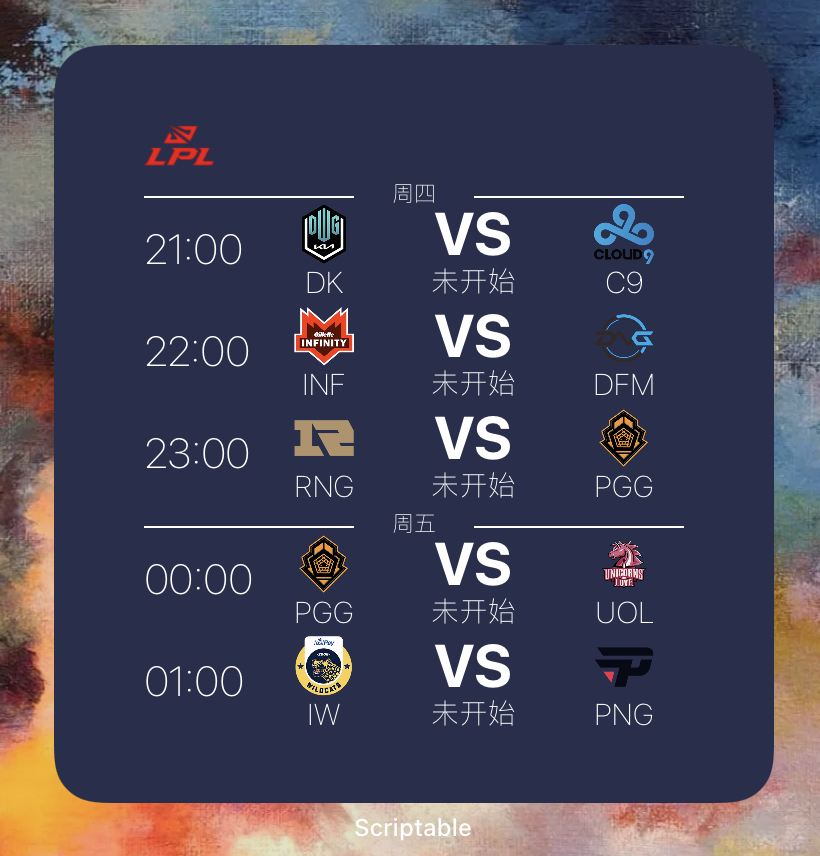

# Scriptable 小组件

### 使用说明
1. IOS用户在App Store下载Scriptable
2. 下载小组件文件到Scriptable中
3. 桌面添加Scriptable小组件后，设置小组件属性，选择运行指定小组件即可。

## 小组件列表
### 1. lpl赛程

下载lpl.js文件到Scriptable中，桌面小组件默认显示2021msi赛程（暂不支持小号组件）

### LICENSE

MIT
