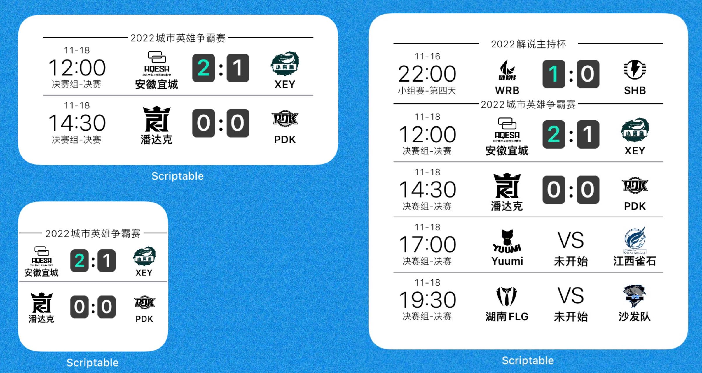
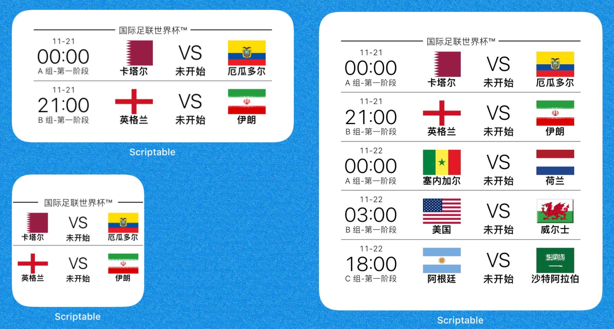

# Scriptable 小组件

### 2022-11-14 更新

1. 新增世界杯赛程小组件。
2. 英雄联盟小组件更改为显示最近赛程（不局限赛事类别）。
### 2022-10-25 更新

1. 百度网盘文件已更新，目前支持2022全球总决赛。
2. 旧版本的小组件用户可在Parameter中输入184即可显示2022全球总决赛赛程。
### 2022-01-20 更新

1. 百度网盘文件已更新，目前支持2020春季赛。
1. 旧版本的小组件用户可在Parameter中输入`167`即可显示2020春季赛赛程。
### 2021-10-11 更新

1. 百度网盘文件已更新，目前支持2021全球总决赛赛程。
1. 旧版本的小组件用户可在Parameter中输入`156`即可显示全球总决赛赛程。
### 2021-05-31 更新

1. 最新版更新到百度网盘链接
1. 2021 夏季赛赛程显示：更新最新版或在小组件设置的第三个参数内输入`148`
### 使用说明

1. IOS用户在App Store下载**Scriptable**
1. **下载小组件文件到Scriptable中**(下载.js文件保存到icloud下的scriptable文件夹中就可以在scriptable软件中看到该组件）

3. **添加小组件**。回到桌面添加一个小组件，选择Scriptable组件，根据个人喜好添加大中小三种size，然后退出桌面编辑模式

4. **设置小组件属性**。长按刚刚添加的空白小组件，点击第一个选项，选择需要运行的小组件，后两个可保持默认，退出组件编辑，小组件即可正常显示。

### 1. lol赛程

下载lol.js文件到Scriptable中，桌面小组件默认显示最新赛程。

### 2. 2022世界杯赛程

下载fifa.js文件到Scriptable中，桌面小组件默认显示最新赛程。

### LICENSE

MIT
